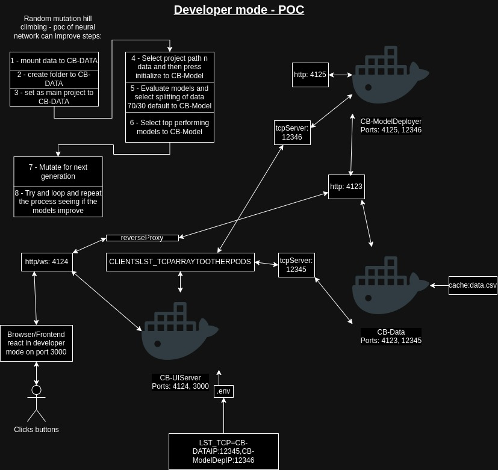

This project is a microservice within a larger system, designed for developing and testing a proof of concept (POC). Its primary role is to communicate with other services in the system that host and cache data or run and deploy AI models. The goal of this project is to see if the model can build and improve on the generated simple data. The system is currently in the testing phase, preparing to validate the POC

